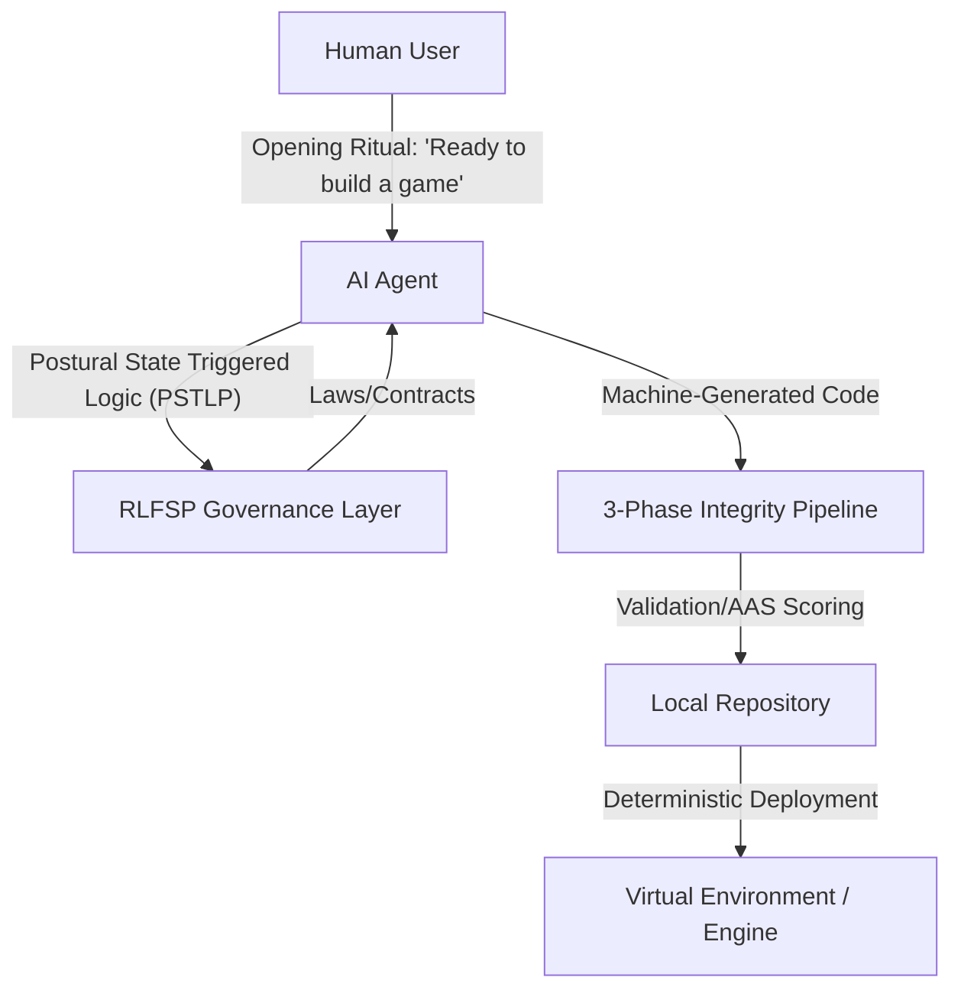
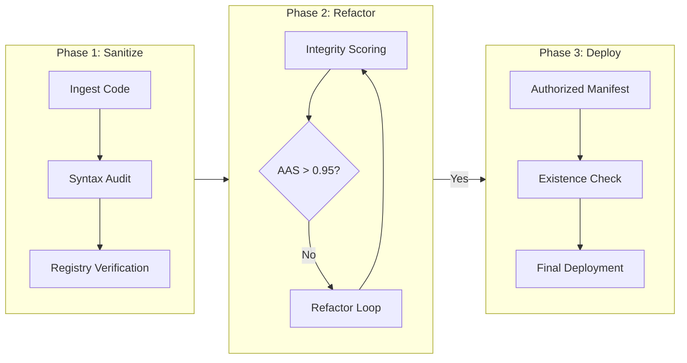
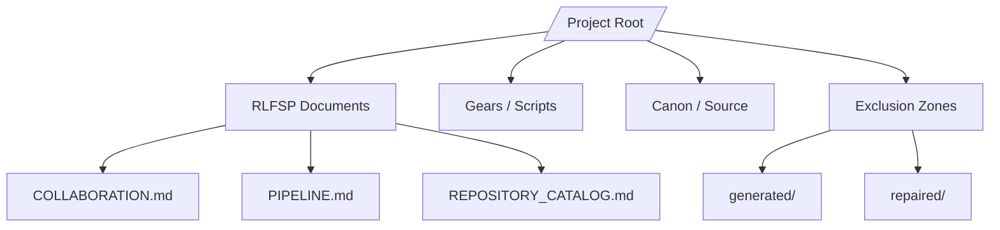

# BLOXBOX PATENT FIGURES (DRAFTS)

## FIG. 1: System Architecture (Collaborator Stance Orchestration)

## FIG. 2: The 3-Phase Integrity Pipeline (Automated Manifestation)

## FIG. 3: Filesystem Hierarchy (Sovereign Governance Boundary)

